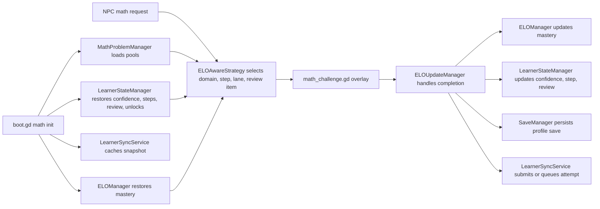
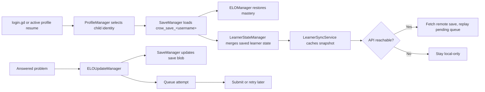
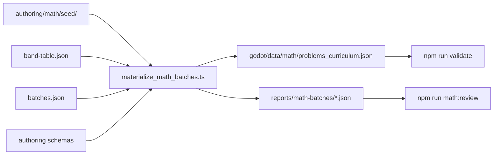

# Hörmann — Architecture

Status: Current
Authority: This is the system reference: shape, contracts, and the numbers that
are frozen on purpose. Runtime truth outranks it — if this file and
`godot/scripts/**`, `godot/data/**` or `server/src/**` disagree, the code is
right and this file is stale.
Last verified against code: 2026-08-25

Mutable counts live in [ONBOARDING.md](./ONBOARDING.md) and nowhere else. This
file describes behaviour and contracts, and quotes a number only when the number
is itself the rule.

## Contents

- [The four trees](#the-four-trees)
- [The parity contract](#the-parity-contract)
- [Conventions the game is held to](#conventions-the-game-is-held-to)
- [The math system](#the-math-system)
- [Identity, save and sync](#identity-save-and-sync)
- [The wire contract](#the-wire-contract)
- [The sprite contract](#the-sprite-contract)
- [The math authoring pipeline](#the-math-authoring-pipeline)
- [Deployment](#deployment)

## The four trees

The most expensive mistake available in this repo is writing correct,
well-tested code in a tree that never ships.

| Tree | What it is | Ships? |
| --- | --- | --- |
| `godot/**` | **The game.** Godot 4.3 / GDScript. The only tree players run. | yes, as `output/web` |
| `server/**` | **The API.** Node 22 + TypeScript + Postgres: cloud save, family auth, error ingestion. | yes, as a Railway service |
| `math-kernel/**` | **The reference kernel.** TypeScript implementation of ELO, learner state and problem selection. | never |
| `tools/**` | Offline curriculum authoring and validation. | never |

The game began as a 1:1 port of a Phaser 3 / TypeScript original. That original
is **deleted**, not merely unused — `src/`, `public/`, `vite/`, `admin.html` and
`archived/` are all gone. If a comment still points at them, the comment is <!-- retired-ref-ok -->
stale and the Godot tree is the only implementation.

Godot-side layout:

- `scripts/boot.gd` — cold-start wiring, then hands off to the first scene.
- `scripts/autoload/` — Config, DataManager, SceneRouter, EventBus, Persistence,
  and the Save / Profile / Text / Level / Leveling / Theme / Audio managers.
- `scripts/math/`, `scripts/systems/` — the learning engine, LevelLoader, sync.
- `scripts/entities/`, `scripts/ui/`, `scripts/scenes/` — gameplay, HUD, screens.
- `data/` — the source of truth: `tuning/`, `i18n/`, `themes/`, `registries/`,
  `audio/`, `levels/`, `math/`, `npcs/`, `enemies/`.
- `tests/` — headless suite, golden fixtures, physics probes.

Autoload order is set in `godot/project.godot` and **matters**: `Persistence` and
`EventBus` first, `CloudSync` last, because it depends on `SaveManager`,
`ProfileManager` and `LearnerSyncService` already existing.

## The parity contract

`math-kernel/` is not dead code and not a second game. It generates
`godot/tests/fixtures/*.json`, which `test_math_parity.gd` and
`test_motion_parity.gd` assert against. That makes it the executable
specification for how difficulty adapts, and it also produced the curriculum the
game ships.

**Tier-1 constants stay in code, not tuning JSON.** The ELO, learner and
movement constants (`elo_manager.gd`, `learner_state_manager.gd`,
`player_motion.gd`, `MAX_RECENT_*`, K-tiers, clamps, gravity 800, review
windows) are the verified 1:1 port of the kernel. Moving them somewhere editable
would invite exactly the silent fidelity drift the golden tests exist to catch.

A Tier-1 change therefore means, in one commit: edit `math-kernel/**`,
regenerate the fixtures, keep Godot parity green.

```bash
npm run godot:gen-math-fixtures
npm run godot:gen-motion-fixtures
```

CI regenerates the fixtures and fails on any diff, so the kernel and the game
cannot drift apart silently.

## Conventions the game is held to

The game is **data-driven by mandate**: you change it by editing JSON, not code.
`godot/tools/check_hardcoding.py` runs in CI and is the enforcing authority.

1. **No magic numbers in `.gd`.** Timings, sizes and thresholds live in
   `data/tuning/*.json`, read via `Config` — `Config.ui("touch/button_size")`,
   `Config.fx("shake/strength")`.
2. **No user-facing strings in `.gd`.** Everything player-visible goes through
   `TextManager.t("key", [args])`. `strings_en.json` and `strings_is.json` stay
   key-for-key in lockstep; a test enforces it, and a missing key renders as the
   raw key to a child.
3. **No inline colours in `.gd`.** `ThemeManager.get_color_value("role")`, with
   roles declared in `data/themes/theme_*.json`.
4. **No hardcoded scene paths.** `SceneRouter.goto("main_menu")`, routed through
   `data/registries/scenes.json`.
5. **No type→behaviour switches for content.** A new level object is one entry in
   `data/registries/spawn_registry.json` plus a scene with
   `setup_from_spawn(spawn)`. No `game.gd` change.
6. **No scattered `play_sfx("key")`.** Fire semantic events:
   `AudioManager.play_event("coin")`, mapped in `data/audio/sound_events.json`.
7. **No sprite paths, frame geometry or anchors in `.gd` or `.tscn`.** See
   [the sprite contract](#the-sprite-contract).

Genuine exceptions — brand text, diagnostics — take `# hardcode-ok` on the line.
"Genuine" does not mean "I was in a hurry".

### Data-first recipes

- **A sprite:** `python3 godot/tools/check_assets.py --spec` prints the required
  size, anchor and art notes per class. Generate to that, drop the PNG under
  `assets/sprites/<role>/`, add an entry to `sprite_registry.json` naming its
  `class` (never its size — that comes from the class), then
  `godot --headless --path godot --import`.
- **A sound:** add a WAV via `tools/gen_sfx.py` or drop a file, list it in
  `data/audio/audio_manifest.json`, map an event in `sound_events.json`, then
  `AudioManager.play_event("your_event")`.
- **A string:** add the key to both `strings_en.json` and `strings_is.json`.
- **A tuning value:** the right `data/tuning/*.json`, read via `Config`.
- **A colour or skin:** a palette role in every `theme_*.json`, read via
  `ThemeManager.get_color_value(role)`.
- **A level:** author `data/levels/specs/*.spec.json`, then `npm run compile`.
  Never hand-edit `data/levels/compiled/**`. To author natively instead, convert
  the compiled levels into editable Godot scenes — a shared `TileSet` per tileset
  image plus a `.tscn` with background/ground/decoration layers and a `Spawns`
  node of `Marker2D`s — and they open in the TileMap editor:

  ```bash
  godot --headless --path godot --script res://tools/import_level.gd
  ```

  The runtime `LevelLoader` stays the parity path either way.
- **A scene or route:** one entry in `scenes.json`, then `SceneRouter.goto(name)`.

## The math system

Tuned for early-elementary learners, and aiming for: high confidence and
frequent success, slow mastery movement, fast downward adjustment during rough
stretches, explicit repetition after failures, and new domains unlocking only
once the current one is genuinely steady.

Target band: roughly **70–85%** first-attempt accuracy over recent history — high
enough to feel like winning, low enough that the problems are still doing work.



The tunable numbers below — promotion, demotion, stretch gate, lane weights,
teaching pacing, golden economy — live in
`godot/data/tuning/math_tuning.json`, which is the **only** copy. Both the
shipped game and the kernel load that file, so tuning a number is one JSON edit
that applies to the runtime and the parity oracle at once.

### Four learner signals

**1. Mastery** — the slow, long-term estimate, ELO-based, in `elo_manager.gd`.
Global ELO plus per-domain modifiers; effective mastery for a domain is
`globalELO + domainModifier`. Default starting global ELO is `150`.

- actual score: `1.0` first-try correct, `0.5` corrected retry, `0.0` wrong
- K-factor: `16` before 30 attempts, `12` before 150, `8` after
- delta cap: `±8` per answer
- update split: `70%` to global ELO, `30%` to the active domain modifier

**2. Curriculum step** — the primary safety rail, per domain, in
`learner_state_manager.gd`. ELO no longer authorizes harder problems by itself.
Selection is capped at one step above the current step, and that stretch step is
only reachable while the learner is hot.

- promotion: after `3` first-try correct at the current step **and** at least
  `80%` first-attempt accuracy across the last `10` attempts in that domain. It
  advances to the next step with at least `3` authored problems, skipping empty
  rungs — it never promotes onto a step the learner cannot practice. A first-try
  correct answer on a stretch problem promotes directly to that step.
- demotion: evaluated **only** on a wrong answer, never re-triggered by later
  correct answers inside the same window. `-1` step after `2` wrong in the last
  `5` attempts for that domain, or when confidence drops to `-25` or below.
  Afterwards confidence is softened to at most `-10`, so one bad patch cannot
  cascade into repeated demotions.
- at boot, stored steps are reconciled against the pools: a domain whose
  authored content starts above the stored step is raised to the first step that
  actually has problems.

**3. Confidence** — session-local, faster than mastery, stored per domain as
`confidenceOffsets` and clamped to `-50..20`. Each completed challenge first
decays the current value by `20%`, then applies `+4` first-try correct, `+1`
corrected retry, `-15` wrong. Effective selection ELO is
`masteryELO + confidenceOffset`. This is what lets the game get easier quickly
during a bad stretch without damaging long-term mastery.

**4. Review** — explicit and skill-based. Stages are `immediate`, `day_1`,
`day_3`, `day_7`, `graduated`. A failed challenge creates or resets an immediate
item, scheduled `2-4` answered problems later. Successful scheduled reviews
advance a stage; after `day_7` the item graduates out of the queue.

### Selection policy

Lane weights in `elo_aware_strategy.gd`:

- `40%` comfort — one curriculum step easier
- `20%` review — due items, `1-2` steps easier
- `30%` at level — the exact current step
- `10%` stretch — one step harder

Stretch is only offered while the learner is hot: at least 5 recent attempts in
the domain, `>= 80%` correct across the last 5, and non-negative confidence.

Empty lanes drop out and their weight is renormalized across the rest, so those
shares are relative, not exact odds. If the requested bands are empty the
strategy steps **down** only — it never falls back to any problem in the domain.

Mixed-domain play: the first configured domain gets `70%` of selections, the
remaining unlocked domains share `30%`, and each still obeys its own step cap.

Kid-safe filter: the owl path caps `maxOperand` at `20`, keeping two-digit
arithmetic out of the live owl loop until a denser later ladder exists.

Recently seen facts are suppressed by **replay key**, not just problem id, so
wording variants of the same fact do not bounce straight back. Every worded shape
has a parse pattern in `math-kernel/math/wordedArithmetic.ts`; steps, difficulty
traits, replay keys and the verifier all re-derive the fact from that shared
table.

### The answer surface

MCQ only. The shared type system supports other answer modes; the live UI does
not render them.

- option order is shuffled twice — deterministically at generation time (the old
  ascending order put the correct answer in a predictable slot) and again at
  render time, which also covers the hand-authored pools
- long prompts scale the question font down and word-wrap, so text always fits
- a second miss reveals the correct answer with its authored explanation before
  the overlay closes, so a failed challenge still ends in teaching
- progress pips show one per first-try at-level win banked toward the next
  promotion. They only ever render as earned-or-not, never draining
- a step-up fires `CURRICULUM_STEP_UP` and the HUD celebrates it once visible.
  Demotions are never signalled

**The teaching window.** When a level's gating includes a domain the child has
never attempted, the owl opens with a worked-example demo: the problem appears,
the localised hint plays as thinking-aloud, then the answer lights up with its
explanation. No input accepted, no learner-model events emitted. It hands over to
a freebie in the same domain — a win records normally, a miss records nothing at
all — so first contact with new maths can never hurt.

**The comeback arc.** A correct answer on a review item whose last outcome was
wrong fires `MATH_COMEBACK`, celebrated harder than an ordinary win: a miss
becomes the setup for the best moment available.

**Golden problems.** Roughly 1 in 8 real owl problems arrives golden — pulsing
gold frame, shimmer chime, bonus coin multiplier. The roll is a seeded coin flip
on `(childId, lifetime attempt index)`, so the same save state always rolls the
same result, and the `goldenRolls` fixtures hold both ports to the identical
draw. Never during the teaching window, and a golden miss costs nothing beyond
the ordinary retry. Rate and multipliers live under `golden` in
`math_tuning.json`; nothing about it is tied to time or streaks.

### Per-level math identity

Each level's `mathGating` — authored in the level spec, mirrored into
`level_registry.json` — names the domains its owls draw from, a difficulty band,
and a required `teachingIntent`: the lesson the level exists to teach. The level's
skill order is its emphasis, and the first listed skill is the headline that gets
the primary selection share.

The designed chain: 01 counting, 02 subtraction, 03 comparison, 04 pattern
matching, 05 number sequences, 99 open practice. Each headline's prerequisite
domain is the level's own on-theme fallback until the headline unlocks.
`npm run validate` fails if the chain stops covering every servable domain, gates
a skill the owl cannot serve, or points a band at fewer than 30 authored
problems. An empty intersection falls back to the NPC config, so a mis-authored
level can never brick.

The curriculum ladder owns *how hard*; the level owns *which maths*.

### Unlock logic

Computed from recent stability, not raw ELO. Prerequisites in
`LearnerStateManager`: counting is open from the start; addition gates
subtraction, multiplication, comparison and number sequence; counting gates
pattern matching; multiplication gates division.

A prerequisite counts as stable only when the last 20 attempts in it exist,
first-attempt accuracy across those 20 is at least `90%`, and the review backlog
trend is not growing.

### Update flow

Centralized in `elo_update_manager.gd` — the single live bridge from an answered
problem into mastery, review, save and sync.

1. `MATH_PROBLEM_PRESENTED` caches domain, problem ELO, skills, selection lane
   and review item id.
2. `MATH_CHALLENGE_COMPLETE` computes the actual score, updates `ELOManager`,
   advances or demotes the curriculum step, records per-problem telemetry, builds
   a `LearnerAttemptSubmission`, records the attempt, saves the profile, and
   submits or queues through `LearnerSyncService`.

### Session recap and trophy shelf

Two menu surfaces close the loop, on the peak-end rule — a session is remembered
by its peak and its ending.

`SessionStats` counts owls saved, problems solved, step-ups, comebacks and golden
wins during play; the main menu consumes it once and ends the recap on the best
moment (comeback beats golden beats step-up). Only positive counts exist, so a
session with nothing to celebrate shows no recap at all.

`curriculumProgress` carries a `highestStep` high-water mark per domain, raised
on every step rise and never lowered. The main menu renders a code-drawn badge
per attempted domain — sprout / leaf / flower / star from `trophies.tierSteps`. A
demotion never shrinks a badge.

### Known limitations

- MCQ-only UI, though the type system supports more.
- Pool ELO ratings are still initialized from legacy static difficulty; local
  selection obeys curriculum steps instead, but the telemetry-facing ELO layer
  is coarse.
- Two-digit addition and subtraction stay out of the owl's local path
  deliberately.
- Subtraction step `5` is structurally sparse under the current derivation, so it
  exists as a tiny bridge rather than a full band.
- Review is queued on failed challenges, not on first wrong attempts that are
  corrected within the same challenge.
- `level_registry.json` still carries `minStars`, which the live learner model
  does not use.

## Identity, save and sync



### Identity model

Fields in `profile_manager.gd`: `username`, `pinHash`, `createdAt`, `childId`,
`familyId`.

A device can hold several child profiles. Each has its own save key and its own
learner keys tied to `childId`. **`familyId` is a device-local handle, never an
authorization subject** — the server issues its own `remoteFamilyId`, stored
alongside it.

`_generate_id()` mints `"child-<ms>-<rand>"` per device, so the same child on an
iPad and a laptop already has two different `childId`s. That is why identity is
resolved server-side and local ids are only ever a mapping.

### Storage contract

All client state is one JSON document at `user://crow_localstorage.json`
(IndexedDB on web), keyed as the original browser build's localStorage was:

| Key | Holds |
| --- | --- |
| `crow_profiles` | the profile list |
| `crow_active_user` | which profile is active |
| `crow_family_id` | device-local family handle |
| `crow_save_<username>` | the profile-scoped `SaveData` blob |
| `crow_save_v1` | legacy single-user save, fallback only |
| `crow_translations` | cached locale bundles |
| `crow_learner_api_base` | debug-only override, not a shipped setting |
| `crow_learner_snapshot_<childId>` | cached learner snapshot |
| `crow_learner_pending_attempts_<childId>` | offline retry queue |

Deleting that file resets a local run. `run_tests.sh` does exactly this between
stages, because autoloads hydrate from it **before** any test scene's `_ready()`
— a probe cannot isolate itself from inside the scene tree.

### Ownership

- **ProfileManager** — profile create / login / logout / delete, save-key
  derivation, family and child id assignment, legacy migration.
- **SaveManager** — the profile-scoped `SaveData` blob: aggregated math stats,
  inventory, coins, XP, levels, settings, and the embedded `eloStats` and
  `learnerState`.
- **LearnerStateManager** — mastery snapshot, confidence offsets, per-domain
  curriculum progress, active review items, recent attempts and problem ids,
  unlock state, summary and frustration flags.
- **LearnerSyncService** — the local snapshot cache and the pending attempt
  queue. Its own remote paths are the retired pre-contract shape and are inert;
  do not extend them.
- **CloudSync** — the live cloud transport: debounced save upload, batched
  attempts, adopt-server-state on conflict, over the same-origin API.

### Truth order

For the active child, truth resolves in this order:

1. `ProfileManager` decides which identity is active.
2. `SaveManager` loads the profile-scoped blob.
3. `ELOManager` restores mastery from `saveData.eloStats`.
4. `LearnerStateManager` merges profile identity with `saveData.learnerState`,
   always refreshing mastery from the live `ELOManager`.
5. `LearnerSyncService` caches the merged snapshot.
6. Queued attempts replay after a remote fetch.

Practical rules: active profile identity always wins over any saved or remote
identity; remote snapshots are normalized back to the active profile's `childId`
and `familyId` before replacing in-memory state; live mastery beats stale mastery
embedded in an older snapshot; the cached local snapshot is the fallback when a
fetch fails; and **a failed remote submission never blocks local progression** —
it only leaves the attempt queued.

Remote success updates in-memory state and the cached snapshot, but does not
immediately rewrite the embedded `learnerState` copy inside the save. That is
refreshed on the next normal save.

### Offline behaviour

Local mastery and learner state update immediately, attempts are queued before
submission, and the snapshot is always cached. If the backend is unreachable the
child keeps playing. **Local-only is a supported state, not an error.**

### The parent surface

In-engine, in `parent_report.gd` — not a separate page. It reads child profiles
from the local store and renders a per-domain line from each child's learner
snapshot: first-attempt accuracy, mastery and confidence, active review skills,
frustration flags.

It surfaces a plain-language note when confidence has dropped, because "the
questions got easier" is deliberate design and reads as a bug without one.

It exposes **no** API base field. That was the old admin page's most dangerous
control: the base was client-writable, so anything on the origin could redirect a
child's learning records.

The old `admin.html` was deliberately not ported. It read browser
`localStorage`, while the Godot build stores everything in
`user://crow_localstorage.json` — identical key names, different storage engine,
so it could not see this game's data at all. Its translation editor was not
replaced either: shipping a live string editor would let anyone on a shared
family device rewrite what a child reads.

### Debug order

1. Confirm which profile is active. Most "impossible" state is another child's
   save.
2. Inspect `user://crow_localstorage.json`; delete it for a clean slate.
3. If behaviour differs after a reload, suspect autoload initialization order.
4. Compare `crow_save_<username>` against
   `crow_learner_snapshot_<childId>`, and check
   `crow_learner_pending_attempts_<childId>` before assuming sync dropped data.
5. Clear the smallest relevant key rather than the whole store.

## The wire contract

**This contract is frozen deliberately.** A change here is a change to every
installed client. A web game updates its client on the next page load but cannot
update a contract that already shipped semantics.

Implementation is `server/**`; the schema is `server/migrations/**`.

### 1. The client finds the API at a relative path

The API base is the literal string `/api/v1`. Not a configurable URL.

This is forced by how deploys work: promotion pushes the *byte-identical*
`output/web` that staging served, so the client cannot carry a compile-time API
base — staging and prod would hit the same API. A relative path plus a
per-environment `reverse_proxy /api/*` in Caddy is the only shape that fits, and
it also means same-origin: no CORS, and the auth cookie is first-party.

`crow_learner_api_base` is demoted to a debug-only override, readable only under
`OS.is_debug_build()`. It is not a configuration input in a shipped build, and it
must never become one again.

### 2. The authorization subject is the device, scoped to a family — never the child

The old `{api_base}/learner/{childId}/attempt` shape, with no credential, is
void. `childId` was never usable as an authorization subject.

The credential is an opaque 256-bit random token in a cookie:

```
Set-Cookie: crow_device=<token>; HttpOnly; Secure; SameSite=Lax;
            Path=/api; Max-Age=34560000
```

Stored server-side as SHA-256 only. Two reasons this beats a token in
`Persistence`:

- The Godot web export has no secure storage. Anything in `Persistence` reaches
  IndexedDB, readable by any script on the origin. `HttpOnly` is not.
- **Safari evicts script-writable storage, IndexedDB included, after about seven
  days without interaction.** A cookie set by the server on a top-level
  navigation survives where IndexedDB does not. This is also the sharpest
  argument that cloud save is necessary rather than nice: the current local-only
  save is already exposed to this.

Because of that second point the cookie **must** be set on the magic-link
redirect — a top-level navigation — and never on an XHR response.

Every read and write resolves `token → device → family`, then scopes
`WHERE child.id = $1 AND child.family_id = $token.family_id`. `childId` may
appear in a path as an object reference; it never grants anything.

Family isolation is enforced twice on the six child-data tables (`children`,
`child_saves`, `child_save_history`, `attempts`, `sync_conflicts`,
`child_aliases`): an explicit `family_id` predicate in every query, and Postgres
row-level security — `ENABLE` plus `FORCE` — with `SET LOCAL app.family_id` per
transaction. The set is derived from `pg_class` and asserted in
`server/test/role-isolation.test.ts`, rather than trusted from the migration's
array.

The four auth tables (`parents`, `devices`, `device_tokens`, `login_codes`) carry
no policy on purpose — resolving a token to a family precedes knowing the family,
so a policy comparing against `app.family_id` has nothing to compare yet. They are
scoped by predicate alone, under the app role. Say so when describing this
mechanism: three docs claimed the database-level guarantee without the exception,
and the exception is where the only PII lives. **The trap found the hard way:** a superuser bypasses RLS
unconditionally, and Railway's `DATABASE_URL` user is one, so the API drops to a
non-superuser role per transaction. Without that, the policies are decorative.

### 3. The PIN never leaves the device

`_hash_pin()` computes `btoa(pin + ':' + username)`, which is reversible by
inspection. The 4-digit PIN is a "which kid am I" selector on a shared family
device. It is not authentication, it never has been, and no server verifies it.

So: never transmitted, never stored server-side, and there is **no `pin_hash`
column**. Building one would import a fake credential for a minor into a
database.

The only PII collected anywhere is the parent's email address. Children carry a
display name and nothing else.

### 4. The sync unit is the save blob, arbitrated by `problemsAttempted`

One document per child. Whole-document, last-writer-wins, where "last" means the
device that has seen more of that child's answers.

The save blob is the right unit because it is the only object containing what a
child experiences as progress — coins, stars, owls saved, levels, abilities —
*and* it already embeds `eloStats` and `learnerState`, with a version field and a
tested migration seam.

Syncing the learner snapshot instead does not work, for a reason easy to miss:
`replace_snapshot()` calls `_refresh_derived_state()`, whose first line is
`_snapshot["mastery"] = _elo().get_stats()`. Mastery is recomputed from
`ELOManager`, which hydrates from `save.eloStats` — not from the snapshot. A
perfect snapshot round-trip onto a fresh device still yields ELO 150.

Field-level merge is not a safer middle ground, it is wrong:
`reviewItems[].dueAfterAttempt` is expressed relative to
`mastery.problemsAttempted`. Merging those from different devices desynchronises
the review queue against its own clock. They travel together.

Arbitration: higher `eloStats.problemsAttempted` wins; tie broken by higher
`save.timestamp`; then by server receipt order. It is already present, already
monotonic, only advances on real play, and is explainable to a parent in one
sentence.

Accepted cost for v1: a device that plays offline while another plays more loses
that session's cosmetic progress. Bounded to one session; every arbitration logs
a conflict event; save versions per child are retained to `config.save.historyDepth`
(`CROW_SAVE_HISTORY_DEPTH`, default 20), so a bad merge is a support action
rather than a loss.

### 5. Attempts are a batched, idempotent, append-only log

`POST /api/v1/attempts/sync` only. There is no single-attempt endpoint.

`attemptId` is client-generated (`"attempt-<ms>-<rand>"` — **not** a UUID, so the
column is `text`) and is the idempotency key: the primary key is
`(child_id, attempt_id)` and inserts are `ON CONFLICT DO NOTHING`. The response
returns `appliedAttemptIds`, and the client clears only those from its queue.
That combination means the merge rule can be improved server-side with no client
change.

`answeredAt` is a child's iPad clock and is not trusted. The server stores both
the claimed `answered_at` and its own `received_at`, orders by server sequence,
and rejects timestamps more than a day in the future.

The attempt log is not the transport for state — it cannot be, because
`_get_review_gap()` uses `randi()` and review ids embed randomness, so a server
cannot reproduce a client snapshot by replaying attempts. It is the durable
record: the answer to "did my child's work get lost".

### Endpoints

`POST /api/v1/errors` is anonymous. Everything else requires the device cookie.

| Method | Path | Auth | Purpose |
| --- | --- | --- | --- |
| `GET` | `/api/v1/health` | none | liveness + migration state |
| `GET` | `/api/v1/auth/session` | none | is this device enrolled? |
| `POST` | `/api/v1/auth/signout` | device | revoke this device's tokens |
| `POST` | `/api/v1/errors` | **none** | client error ingestion |
| `POST` | `/api/v1/auth/request-link` | none | email a magic link |
| `GET` | `/api/v1/auth/consume` | link token | top-level nav; sets device cookie |
| `POST` | `/api/v1/auth/pair` | device | issue a pairing code for a 2nd device |
| `POST` | `/api/v1/auth/redeem` | none | redeem a pairing code, sets cookie |
| `GET` | `/api/v1/family/children` | device | list children for child-picking |
| `POST` | `/api/v1/family/children` | device | create a child, returns server id |
| `GET` | `/api/v1/children/{id}/save` | device | fetch authoritative save |
| `PUT` | `/api/v1/children/{id}/save` | device | upsert save, compare-and-set |
| `POST` | `/api/v1/attempts/sync` | device | batch attempts, returns applied ids |
| `DELETE` | `/api/v1/family` | device | hard delete, cascade |
| `GET` | `/api/v1/family/export` | device | full data export |

The delete and export paths exist from the first release that stores anything.
They are cheap now and awkward to retrofit, and for children's data a delete path
is not optional.

### Schema shape

- `families` ← `parents(email)` — the parent's email is the only PII stored
- `children(family_id, display_name)` — no PIN, no other child data
- `devices` + `device_tokens(token_sha256)` — the authorization subject is the
  device, scoped to a family, never the child. `devices.user_agent` holds the
  browser's UA line (≤400 chars), written at enrolment so the device list can name
  a device rather than show an id. Nothing prunes it: it lives as long as the
  device row, unlike the copy on an error report, which goes with its day
  partition. `PRIVACY.md` says so too — it did not until a review found this
  column disclosed nowhere.
- `child_saves` — one blob per child, arbitrated by `problems_attempted`
- `child_save_history` — the last `CROW_SAVE_HISTORY_DEPTH` versions (default
  20), so a bad merge is recoverable
- `attempts(child_id, attempt_id)` — append-only, idempotent, `text` ids
- `sync_conflicts` — instrumentation for the accepted v1 merge cost
- `child_aliases` — maps a client-minted child id to the server's, so a second
  device enrolling into an existing family resolves to the same child instead of
  creating a duplicate
- `login_codes(email citext)` — sign-in links and pairing codes, single-use and
  short-lived, enforced in SQL. The second place the parent email lives, and the
  reason the sentence above says "the only PII" rather than "the only column"
- `error_groups(fingerprint)` — one row per distinct bug: counts, message, source,
  release, and one sample of coarse context plus stack. Kept indefinitely; this
  is what `PRIVACY.md` describes as "more than a count"
- `error_events` — the raw reports, **daily-partitioned**, dropped whole past
  `CROW_ERROR_RETAIN_DAYS` (default 30). Partitioning IS the retention mechanism
- `schema_migrations` — applied-migration bookkeeping; `GET /api/v1/health`
  counts it to distinguish a broken deploy from a broken database

`error_groups` and `error_events` carry no `family_id` and no RLS policy: an error
report is not family-scoped and must be acceptable from a device that has never
enrolled. They are still written as `crow_app`, which holds INSERT and no DELETE
on `error_events` — retention drops partitions as the owner, the application
cannot delete a report.

Mastery is deliberately **not** a table. `learner_state_manager.gd` recomputes it
from ELO on every read, so storing it as authoritative would invite drift. If a
parent dashboard ever needs it server-side, it is a projection off `attempts` and
should be labelled as one.

### Client-side budgets

Part of the contract, because they protect the server from the client.

| Concern | Rule | Why |
| --- | --- | --- |
| Save upload | debounce ~20 s, plus on `APPLICATION_PAUSED`, plus on scene change | `SaveManager` wires `coins_changed → save()`, so every coin pickup is a local save. Uploading per save would melt the API. Do not rely on page-unload on the web. |
| Attempt batches | ≤100 attempts, ≤256 KB | bounded work per request |
| Save blob | ≤512 KB | it is a JSON document, not a filesystem |
| Error events | ≤10/session, ≤1 per fingerprint/session, ≤20 KB each, ring buffer that drops when full, honour `429` + `Retry-After` | errors are droppable; attempts are not |
| Writes | ≤6/min/device | server-enforced too |

The cloud flush is a *separate* debounce layered above `SaveManager`. Do not
change `SaveManager`'s local cadence — saving locally often is correct.

`HTTPRequest` needs an absolute URL: a relative `/api/...` path fails at runtime
with a URL parse error, which is why `CloudSync` resolves the page origin first.

### Build order

Ranked by reversibility, which here is also the right shipping order.

- **Phase 1 — error ingestion only.** No auth, tiny blast radius, and it is what
  tells us how a launch is actually going on real devices. Ships first.
- **Phase 2 — enrollment, magic link, device cookie, single-device cloud save.**
- **Phase 3 — second-device pairing, conflict instrumentation, parent view.**

Deferred: a server-side reducer, mastery projection tables, attempt analytics,
partitioning of `attempts`, per-PR preview environments. Explicitly out of scope
— anti-cheat: a child who fakes an answer only mis-tunes their own difficulty.

## The sprite contract

`brand/ASSET_MANIFEST.md` states what a sprite must be — 64×64 for characters,
enemies, NPCs and props, 88×96 for doors, 32×32 for coins and HUD icons, no
anti-aliasing, authored at 1x. **Where this section and the manifest disagree,
the manifest wins.** This describes the machinery that holds the code to it.

Before that machinery, every sprite path and frame grid was a literal wherever it
happened to be drawn: twelve `res://assets/sprites/**.png` strings across eight
`.gd` files, six duplicated `spritesheet`/`frameWidth`/`frameHeight` blocks in
`npc_registry.json`, and a hardcoded `offset` in four `.tscn` files.

Two files carry it now:

| File | Says |
| --- | --- |
| `data/registries/sprite_spec.json` | what each **kind** must be — frame size, anchor, art notes. The manifest's pixel law, as data. |
| `data/registries/sprite_registry.json` | what each **asset** is — class, path, frame count, fps. Size and anchor are inherited and must not be restated. |

Tilesets are deliberately absent: `data/tilesets/tileset_manifest.json` already
owns their contract, and it is the better model for them.

Two tested properties follow. **One edit retargets a whole kind** — change
`character.frameHeight` and every character sprite moves with it, no code, no
scenes. **One asset can still deviate**, by putting the field on that sprite with
a `why`; the build rejects an override without one. `board_panel` is the live
example: a 96×96 nine-slice source in a 32×32 UI class, because that is what
ASSET_MANIFEST Priority 4 specifies.

Reach a sprite through `SpriteSheet`, never a path:

```gdscript
_sprite.texture      = SpriteSheet.texture("owl")
_anim.sprite_frames  = SpriteSheet.frames("coin")
_sprite.offset       = SpriteSheet.anchor_offset("crow_walk", SpriteSheet.grounding_sink())
```

### Anchors are derived, not written down

A literal `offset = Vector2(0, -28)` encodes **two** things at once: half the
*current* 64px frame, plus the 4px grounding sink. Swap in a 96px-tall crow and
the same `-28` silently means half of 96 minus 20 — the sink jumps to 20px, the
new sprite renders buried, nothing errors, and the new art takes the blame.

So the anchor comes from the class (`feet` = the frame's bottom edge lands on the
node origin; `center` = centred on it) and the sink is one named value,
`fx_tuning.grounding_sink_px`, compensating the **tileset's** grass lip rather
than any one character's art.

The derived values reproduce the old `.tscn` literals exactly — `-28` for player
and enemy, `-48` for the door, `0` for the coin — so this moved nothing on
screen. `test_sprite_anchoring.gd` asserts both halves: that the rule holds at
frame heights the project does not ship (16 to 250 px), and that today's sprites
still land on the old numbers.

### Slots for art that has not been drawn

ASSET_MANIFEST Priority 4 commissions themed HUD and board icons that do not
exist yet. Those are registered `"optional": true` with, where sensible, a
`fallback` key. A missing optional file is a warning, not a failure, and
`SpriteSheet.texture()` resolves the fallback so the game keeps rendering. Drop
the real file in and it is picked up with no code change.

### The tools

```bash
python3 godot/tools/check_assets.py          # the contract; runs in run_tests.sh
python3 godot/tools/check_assets.py --spec   # the delivery brief, printed from the data
python3 godot/tools/audit_pixel_art.py       # is the art actually pixel art?
python3 godot/tools/audit_pixel_art.py --crops DIR   # 1x/2x/4x Nearest, to judge by eye
```

`check_assets.py` fails the build on a missing or orphaned file, an unknown
class, a sheet that is not a whole number of its class's cells, an unjustified
override, a `res://assets/**.png` literal in `.gd`, or an `offset`/`scale` on a
sprite node in a `.tscn`.

`audit_pixel_art.py` measures the two manifest rules that can be measured:
`soft%` is "no anti-aliasing", `native` is "author at 1x, never downscale". It
currently reports that several shipped sprites break the first one — `crow_walk`
at 34.5% soft-alpha, `cockroach` 41.1%, `crow_idle` 29.8% — while all are native
1x. That is a finding about the art, not the machinery, which is why the tool
prints rather than fails.

## The math authoring pipeline

The runtime ships **concrete** JSON pools. The authoring layer is offline-only
and runs on `math-kernel/**`, which never ships.



```bash
npm run math:materialize   # seed + batch specs -> curriculum pool + review reports
npm run math:review        # same materialization in memory, grades to the terminal
npm run validate           # schemas, answer drift, metadata drift, band alignment
```

`math:materialize` loads the seed curriculum plus the offline batch specs,
protects exact prompt text already present in the seed and the legacy runtime
pools, rewrites `godot/data/math/problems_curriculum.json`, and rewrites the
batch review reports.

**Do not hand-edit `problems_curriculum.json`.** Treat it as a materialized
output; author in `authoring/math/**` and rerun the pipeline.

### Authoring contracts

The **band table** owns intended curriculum-step and initial-ELO ranges. Batch
templates reference a `bandId`, and concrete problems never set difficulty ad
hoc — materialization derives it from the band table.

**Batch specs** are organized as 18 small waves and use deterministic templates
rather than freeform authoring, which keeps the runtime pool concrete and fully
reviewable. Generated problems carry `generator` metadata for provenance and stay
plain concrete `MathProblem` rows; no generator runs during play.

### What `validate` actually checks

- authoring and runtime problem schemas
- curriculum drift between offline authoring and live output
- recomputed arithmetic answers, failing on answer drift
- recomputed `difficultyTraits`, failing on metadata drift
- duplicate prompt text across the shipped pools
- generated problems falling outside their intended step or ELO bands
- checked-in review reports drifting from freshly recomputed output

### Reading the owl reports

- `owlEligible*` — the full owl-safe runtime inventory after owl-domain filtering
- `openingUnlockedInventory*` — unlocked-domain inventory **before** current-step
  clamping
- `freshReachable*` — the real fresh-profile day-one reachable subset **after**
  clamping
- `currentInteractionProblemCount` — the shipped owl encounter length, from the
  live NPC config

**Use `owl-surface-summary.json` for the owl-safe subset, not the headline
inventory total.** The two are routinely confused, and the total is the number
people quote wrongly.

### Evidence boundaries

What the pipeline proves: the shipped pools are concrete, schema-valid,
arithmetic-valid and exact-prompt-deduped; generated problems stay inside their
intended step and ELO bands; the owl path stays inside its local-safe rails in
the smoke run.

What it does **not** prove: telemetry-backed pedagogical calibration; that the
frozen ELO bands are empirically right for any particular child; semantic dedupe
of the same fact phrased differently; or that total inventory equals owl-path
experience. None of it substitutes for playing with a real child — the reports
can prove rail safety and coverage, but not whether a specific six-year-old finds
the mix delightful or tiring.

### Guardrails

- Do not hand-grow the `gaps` or `dataset` pools as a long-term path.
- Do not merge LLM-authored concrete problems straight into runtime pools.
- Do not edit the materialized curriculum without rerunning `math:materialize`.
- If a batch fails review, fix that batch and rerun before authoring more.

## Deployment

The staging and production runbook — services, environments, promotion,
rollback — is [deploy/RAILWAY.md](./deploy/RAILWAY.md), kept beside the
Dockerfiles and Caddyfile it describes.

Two properties of it are architectural, and load-bearing above:

- **Promotion pushes the byte-identical `output/web` that staging served.** This
  is why the API base must be a relative path, and why `output/web` is committed
  rather than built per environment.
- **Migrations are forward-only and expand/contract.** A destructive migration
  must never ship in the same deploy as the code that stops using the thing being
  dropped, because that combination has no rollback.
