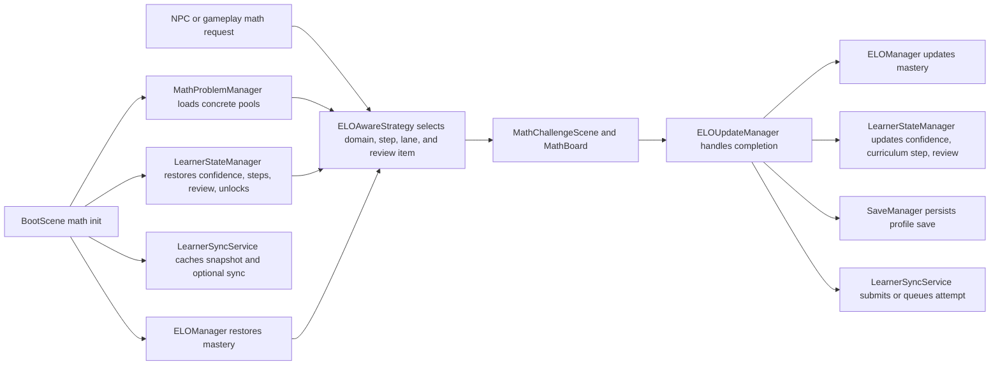

# Hörmann Math System Architecture

Status: Current
Authority: Runtime code and data, especially `BootScene`, `MathProblemManager`, `ELOManager`, `ELOAwareStrategy`, `LearnerStateManager`, `ELOUpdateManager`, `SaveManager`, and `LearnerSyncService`.
Last verified against code: 2026-03-31

## Purpose

This document explains the live math progression system in Hörmann.

What this is:
- the current runtime model for problem loading, adaptive selection, mastery updates, confidence shifts, review scheduling, and unlock logic
- a handoff document for contributors touching learner difficulty behavior

What this is not:
- not a historical design log
- not a speculative product roadmap
- not the save and sync deep dive

For identity, persistence, and hosted sync details, also read [docs/LEARNER_STATE_AND_SYNC_ARCHITECTURE.md](./docs/LEARNER_STATE_AND_SYNC_ARCHITECTURE.md).

For offline math authoring, batch materialization, and review outputs, read [docs/MATH_AUTHORING_PIPELINE.md](./docs/MATH_AUTHORING_PIPELINE.md).

## Runtime Map



## Design Intent

Hörmann is tuned for early elementary learners and aims for:

- high confidence and frequent success
- slow mastery movement
- fast downward adjustment during rough stretches
- explicit repetition after failed challenges
- stable unlocking of new domains only after the current domain is truly steady

Current target band:
- roughly `70-85%` first-attempt accuracy over recent history — high enough to
  feel like winning, low enough that the problems are still doing work

## Runtime Composition

Boot-time math initialization happens in [src/scenes/BootScene.ts](./src/scenes/BootScene.ts):

- `MathProblemManager` loads 4 pools:
  - `easy`
  - `dataset`
  - `gaps`
  - `curriculum`
- for current counts, use the dated snapshot in [ONBOARDING_AGENT.md](./ONBOARDING_AGENT.md)
- runtime still loads only concrete JSON pools; the new template authoring layer is offline-only
- `ELOManager` initializes long-term mastery from save data or defaults
- `LearnerStateManager` initializes confidence, review queue, unlock state, recent attempts, and summary state
- `LearnerSyncService` caches the learner snapshot and optionally syncs with a hosted backend
- `ELOUpdateManager` subscribes to math events and becomes the single live bridge from answered problems into mastery, review, save, and sync

## Problem Presentation Flow

1. Gameplay or NPC interaction requests a math problem through `MathProblemManager`.
2. `MathProblemManager` delegates to `ELOAwareStrategy`.
3. `ELOAwareStrategy` uses `LearnerStateManager` plus problem metadata to calculate:
   - effective selection ELO
   - current curriculum step
   - due review items
   - local kid-safe ceilings such as operand caps
4. `MathProblemManager` suppresses recently seen arithmetic facts by replay key, not just exact problem IDs, so wording variants of the same fact do not bounce back immediately.
5. `MathChallengeScene` presents the selected problem.
6. `MathBoard` renders the answer UI.

Current answer UI:
- MCQ only
- option order is shuffled twice: deterministically at generation time (the
  old ascending order put the correct answer in a predictable slot) and again
  at render time in `MathBoard`, which also covers the hand-authored pools
- long prompts (framed questions and word problems) scale the question font
  down and word-wrap so the text always fits the board
- a second miss reveals the correct answer with the authored explanation
  before the overlay closes, so a failed challenge ends in teaching
- a curriculum step-up fires `CURRICULUM_STEP_UP`, and the HUD celebrates it
  once it is visible again; demotions are never signaled

Prompt wording:
- addition and subtraction include word-problem variants ("You have 3 berries.
  You find 2 more.") from curriculum step 3 upward; steps 0-2 stay on the bare
  equation and simplest question form so reading load never gates the math
- every worded shape has a parse pattern in
  [src/math/wordedArithmetic.ts](./src/math/wordedArithmetic.ts); steps,
  difficulty traits, replay keys, and the verifier all re-derive the fact from
  that shared table, so wording variants of one fact share a replay key

The shared type system still supports other answer modes, but the live UI does not render them.
The shipped owl interaction is currently two problems per encounter, so total repo inventory and per-session lived variety are still not the same thing.
The live owl path is addition-first, and the fresh opening mix currently reaches `addition` plus `counting` to create softer "lucky easy ones" without jumping into later arithmetic too early.
Pattern matching is part of the broader owl-safe set, but it does not start unlocked on a fresh learner profile.
When an encounter reaches its follow-up question, the runtime now prefers an alternate unlocked owl-safe domain before falling back to the full owl-safe set, so the second prompt is less likely to be "more addition again" unless the learner has no safe alternative unlocked.

## Learner Model

Hörmann now uses 4 learner signals for local math selection.

### 1. Mastery

Long-term skill estimate is still ELO-based:

- global ELO plus per-domain modifiers
- default starting global ELO: `150`
- effective mastery for a domain:
  - `globalELO + domainModifier`

Live update behavior in [src/math/ELOManager.ts](./src/math/ELOManager.ts):

- expected score uses standard ELO expectation
- actual score:
  - `1.0` for first-try correct
  - `0.5` for corrected retry
  - `0.0` for wrong
- K-factor:
  - `16` before 30 attempts
  - `12` before 150 attempts
  - `8` afterward
- delta cap:
  - `+8` max upward per answer
  - `-8` max downward per answer
- update split:
  - `70%` to global ELO
  - `30%` to the active domain modifier

### 2. Curriculum Step

Local problem selection is now capped by an explicit per-domain curriculum step.

Live behavior in [src/systems/LearnerStateManager.ts](./src/systems/LearnerStateManager.ts):

- each domain stores:
  - `currentStep`
  - `winsAtCurrentStep`
  - recent step results
- selection is capped at one step above the current step, and that stretch
  step is only reachable while the learner is hot (see selection policy)
- promotion:
  - after `3` first-try correct answers at the current step
  - and at least `80%` first-attempt accuracy across the last `10` attempts in that domain
  - the ladder advances to the next step with at least `3` authored problems,
    skipping empty or near-empty steps; it never promotes onto a rung the
    learner cannot practice
  - a first-try correct answer on a stretch problem promotes directly to that step
- demotion:
  - evaluated only on a wrong answer, never re-triggered by later correct answers
    still inside the window
  - `-1` step after `2` wrong answers in the last `5` attempts for that domain
  - or when confidence for that domain drops to `-25` or below
  - after a demotion, confidence is softened to at most `-10` so one bad patch
    cannot cascade into multiple demotions
- starting steps are reconciled against the problem pools at boot: a domain
  whose authored content starts above the stored step is raised to the first
  step that has problems

This is the primary local safety rail for young learners. ELO no longer authorizes harder local problems by itself.

### 3. Confidence

Confidence is session-local and moves faster than mastery.

Live behavior in [src/systems/LearnerStateManager.ts](./src/systems/LearnerStateManager.ts):

- stored per domain as `confidenceOffsets`
- clamped to `-50..20`
- each completed challenge first decays the current value by `20%`
- then applies:
  - `+4` for first-try correct
  - `+1` for corrected retry
  - `-15` for wrong

Effective selection ELO is:

```text
masteryELO + confidenceOffset
```

This lets Hörmann get easier quickly during a bad stretch without destroying long-term mastery.

### 4. Review

Review is explicit and skill-based.

Each review item stores:
- domain
- skill
- source problem
- anchor problem ELO
- stage
- due time or due-after-attempt count
- successful scheduled reviews

Live stages:
- `immediate`
- `day_1`
- `day_3`
- `day_7`
- `graduated`

Rules:
- a failed challenge result creates or resets an immediate review item
- immediate review is scheduled `2-4` answered problems later
- successful scheduled reviews advance to `day_1`, `day_3`, and `day_7`
- after the `day_7` success, the item graduates and is removed from the active queue

## Problem Selection Policy

Live local weighting in [src/math/selection/ELOAwareStrategy.ts](./src/math/selection/ELOAwareStrategy.ts):

- `40%` comfort
- `20%` review
- `30%` at level
- `10%` stretch

Lane behavior:

- comfort:
  - one curriculum step easier than the learner's current step
- review:
  - due review items matched against review-friendly problems `1-2` steps easier than current
- at level:
  - exact current curriculum step
- stretch:
  - one curriculum step harder than current
  - only offered while the learner is hot: at least 5 recent attempts in the
    domain, correct-answer rate `>= 80%` across the last 5, and
    non-negative confidence
  - a first-try correct stretch answer promotes the learner to that step

Empty lanes drop out and their weight is renormalized across the remaining
non-empty lanes, so the shares above are relative, not exact odds.

If the requested bands are empty:
- strategy steps down only
- it does not fall back to any problem in the full domain

Local mixed-domain policy:

- mixed-domain play still exists when the NPC allows multiple domains
- the first configured domain gets `70%` of selections
- the remaining unlocked domains share `30%`
- each domain still obeys its own current-step cap

Local kid-safe filter:

- the owl path currently caps `maxOperand` at `20`
- this keeps two-digit addition and subtraction out of the live local owl loop until a denser later ladder exists
- Bridge Pack A now gives local owl play dense middle-band coverage for addition steps `10-19` and subtraction steps `6-13`.
- Subtraction step `5` remains intentionally tiny because the current derivation only yields a narrow `10 - 0` / `10 - 10` style prompt shape there.
- The repo now ships `3150` total runtime problems, but the current owl-safe local subset is smaller; use `reports/math-batches/owl-surface-summary.json` when you need the owl-safe inventory and fresh-profile subset instead of the full inventory headline.
- `openingUnlockedInventory*` in that report means unlocked-domain inventory before current-step clamping.
- `freshReachable*` in that report means the real fresh-profile day-one reachable subset after current-step clamping.
- The owl-safe surface is not arithmetic-only anymore: early fresh encounters can mix addition with counting, while pattern matching joins later and subtraction still waits for addition stability.
- The component-level fallback and the internal ELO fallback now preserve the same operand, step, and difficulty caps instead of silently widening when the recent-window logic resets.
- `runtime-selector-smoke.json` is runtime-aligned selector evidence built from the shared owl-selection helper plus live learner-state and NPC-config rails; it is not the literal browser scene/input/retry flow by itself.
- `runtime-browser-smoke.json` is the current browser-backed proof artifact for the real owl interaction, wrong-answer retry, second-problem follow-up, and overlay close path.
- `runtime-browser-smoke.json` is still not telemetry-backed pedagogy proof and does not independently validate that the frozen ELO bands are perfect for every child.

## Unlock Logic

Domain unlocking is computed from recent stability, not just raw ELO.

Current prerequisites live in `LearnerStateManager`:

- subtraction requires addition
- multiplication requires addition
- division requires multiplication
- counting is open from the start
- comparison requires addition
- pattern matching requires counting
- number sequence requires addition

A prerequisite domain only counts as stable when:
- the last 20 attempts in that prerequisite exist
- first-attempt accuracy across those 20 is at least `90%`
- review backlog trend is not growing

## Runtime Update Flow

The live update path is centralized in [src/systems/ELOUpdateManager.ts](./src/systems/ELOUpdateManager.ts):

1. `MATH_PROBLEM_PRESENTED`
   - caches domain, problem ELO, skill list, selection lane, and review item id
2. `MATH_CHALLENGE_COMPLETE`
   - computes actual score for mastery update
   - updates `ELOManager`
   - updates curriculum step progression in `LearnerStateManager`
   - records per-problem attempt and success telemetry in the pool manager
   - builds a `LearnerAttemptSubmission`
   - records the attempt in `LearnerStateManager`
   - records aggregated math stats in `SaveManager`
   - saves the profile
   - submits or queues the attempt through `LearnerSyncService`

## Persistence Touchpoints

Math state is persisted in 2 layers:

- `SaveManager` stores `eloStats` and `learnerState` inside the active profile save
- `LearnerSyncService` separately caches:
  - `crow_learner_snapshot_<childId>`
  - `crow_learner_pending_attempts_<childId>`

This gives Hörmann:
- immediate local continuity
- per-profile learner persistence
- optional hosted sync when a learner API base is configured

## Parent And Admin Visibility

[admin.html](./admin.html) now exposes a learner summary panel that reads local learner snapshots and shows:

- first-attempt accuracy
- summary cards with up to four visible domain rows per child, including mastery and confidence
- active review skills
- frustration flags
- learner API base URL configuration

## Current Limitations

- Math UI is MCQ-only even though the type system supports additional answer modes.
- Audio manifest is music-only today, so many gameplay SFX calls degrade silently.
- Level registry still carries `minStars`, but the live learner model is separate from that legacy progression field.
- Problem pool ELO ratings are still initialized from legacy static difficulty; local selection now obeys curriculum steps instead, but the telemetry-facing ELO layer is still coarse.
- Two-digit addition and subtraction remain intentionally out of the owl's local path until a denser later ladder exists.
- Subtraction step `5` is structurally sparse under the current curriculum-step derivation, so it exists only as a tiny bridge instead of a six-prompt band.
- The opening owl steps still contain a limited number of unique arithmetic facts even though they now avoid recent same-fact repeats more aggressively.
- Review queue scheduling happens on failed challenges, not on first wrong attempts that are later corrected within the same challenge.
- The SQL schema exists as a companion design artifact, not a shipped backend implementation.
