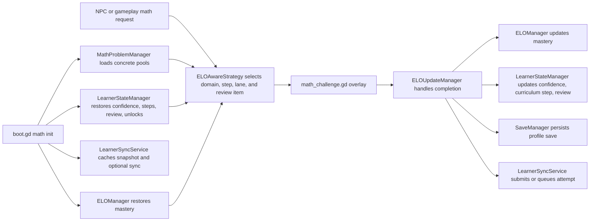

# Hörmann Math System Architecture

Status: Current
Authority: Runtime code and data, especially `data_manager.gd`, `math_problem_manager.gd`, `elo_manager.gd`, `elo_aware_strategy.gd`, `learner_state_manager.gd`, `elo_update_manager.gd` and `save_manager.gd`. The executable specification for these numbers is `math-kernel/**`, locked by `godot/tests/fixtures/**`.
Last verified against code: 2026-08-25

## Purpose

This document explains the live math progression system in Hörmann.

What this is:
- the current runtime model for problem loading, adaptive selection, mastery updates, confidence shifts, review scheduling, and unlock logic
- a handoff document for contributors touching learner difficulty behavior

What this is not:
- not a historical design log
- not a speculative product roadmap
- not the save and sync deep dive

For identity, persistence, and hosted sync details, also read [docs/LEARNER_STATE_AND_SYNC_ARCHITECTURE.md](./docs/LEARNER_STATE_AND_SYNC_ARCHITECTURE.md).

For offline math authoring, batch materialization, and review outputs, read [docs/MATH_AUTHORING_PIPELINE.md](./docs/MATH_AUTHORING_PIPELINE.md).

For what a curriculum step MEANS, and the lesson each meaning opens with, read [docs/MATH_CONCEPT_LADDER.md](./docs/MATH_CONCEPT_LADDER.md).

For what a child actually EXPERIENCES across a whole journey -- which subjects
open when, how soon each is served after it is earned, and how much of the
shipped content one learner ever meets -- read
[docs/LEARNER_JOURNEY.md](./docs/LEARNER_JOURNEY.md). It is measured by
`tools/sim_learner_journey.ts`, which runs in `npm run validate`.

## Runtime Map



## Design Intent

Hörmann is tuned for early elementary learners and aims for:

- high confidence and frequent success
- slow mastery movement
- fast downward adjustment during rough stretches
- explicit repetition after failed challenges
- stable unlocking of new domains only after the current domain is truly steady

Current target band:
- roughly `70-85%` first-attempt accuracy over recent history — high enough to
  feel like winning, low enough that the problems are still doing work

## Runtime Composition

Boot-time math initialization happens in [godot/scripts/autoload/data_manager.gd](./godot/scripts/autoload/data_manager.gd):

- `MathProblemManager` loads 4 pools:
  - `easy`
  - `dataset`
  - `gaps`
  - `curriculum`
- for current counts, use the dated snapshot in [ONBOARDING_AGENT.md](./ONBOARDING_AGENT.md)
- runtime still loads only concrete JSON pools; the new template authoring layer is offline-only
- `ELOManager` initializes long-term mastery from save data or defaults
- `LearnerStateManager` initializes confidence, review queue, unlock state, recent attempts, and summary state
- `LearnerSyncService` caches the learner snapshot and optionally syncs with a hosted backend
- `ELOUpdateManager` subscribes to math events and becomes the single live bridge from answered problems into mastery, review, save, and sync

## Problem Presentation Flow

1. Gameplay or NPC interaction requests a math problem through `MathProblemManager`.
2. `MathProblemManager` delegates to `ELOAwareStrategy`.
3. `ELOAwareStrategy` uses `LearnerStateManager` plus problem metadata to calculate:
   - effective selection ELO
   - current curriculum step
   - due review items
   - local kid-safe ceilings such as operand caps
4. `MathProblemManager` suppresses recently seen arithmetic facts by replay key, not just exact problem IDs, so wording variants of the same fact do not bounce back immediately.
5. `math_challenge.gd` presents the selected problem.
6. `MathBoard` renders the answer UI.

Current answer UI:
- MCQ only
- option order is shuffled twice: deterministically at generation time (the
  old ascending order put the correct answer in a predictable slot) and again
  at render time in `MathBoard`, which also covers the hand-authored pools
- long prompts (framed questions and word problems) scale the question font
  down and word-wrap so the text always fits the board
- a second miss reveals the correct answer with the authored explanation
  before the overlay closes, so a failed challenge ends in teaching
- a curriculum step-up fires `CURRICULUM_STEP_UP`, and the HUD celebrates it
  once it is visible again; demotions are never signaled

Prompt wording:
- addition and subtraction include word-problem variants ("You have 3 berries.
  You find 2 more.") from curriculum step 3 upward; steps 0-2 stay on the bare
  equation and simplest question form so reading load never gates the math
- every worded shape has a parse pattern in
  [src/math/wordedArithmetic.ts](./src/math/wordedArithmetic.ts); steps,
  difficulty traits, replay keys, and the verifier all re-derive the fact from
  that shared table, so wording variants of one fact share a replay key

The shared type system still supports other answer modes, but the live UI does not render them.
The shipped owl interaction is one problem per encounter — answer it and the owl is saved. `problemCount` stays per-NPC config in `npc_registry.json`, so a future gated variant (e.g. a padlock owl) can demand more without code changes.

Per-level math identity:
- each level's `mathGating` (authored in the level spec, mirrored into
  `level_registry.json`) names the domains its owls draw from, a difficulty
  band, and a required `teachingIntent` — the lesson the level exists to
  teach; the owl component intersects skills and band with its own NPC config
- the level's skill order is its emphasis: the intersection keeps the LEVEL's
  order, and the first listed skill is the headline that gets the primary
  selection share
- the designed chain: 01 counting (+addition), 02 subtraction (+addition),
  03 comparison (+counting), 04 pattern matching (+counting),
  05 number sequences (+addition, subtraction), 99 open practice — each
  headline's prerequisite domain is the level's own on-theme fallback until
  the headline unlocks, and `npm run validate` fails if the chain stops
  covering every servable domain, gates a skill the owl cannot serve, or
  points a band at fewer than 30 authored problems
- the curriculum ladder still owns how hard within that band; the level owns
  which math — an empty intersection falls back to the NPC config so a
  mis-authored level never bricks

The teaching window:
- when a level's gating includes a domain the child has never attempted
  (`totalAttempts` of 0 in `curriculumProgress`), the owl opens with a lesson
  before it opens with a question
- where the concept ladder has a lesson for the rung that child starts on, that
  four-card lesson is what plays (see **Concept ladder and lessons** below)
- the fallback, for a rung with no lesson authored, is the original
  worked-example demo: the problem appears, the localised hint plays as
  "thinking aloud", then the answer lights up with its explanation — no input
  accepted, no learner-model events emitted
- either way the teaching hands over to a freebie problem in the same domain: a
  win records normally, a miss records nothing at all, so first contact with new
  math can never hurt

The comeback arc:
- a correct answer on a review item whose last outcome was wrong fires
  `MATH_COMEBACK`, celebrated on the HUD harder than an ordinary win —
  a miss becomes the setup for the best moment available

Progress pips:
- the overlay shows one pip per first-try at-level win already banked toward
  the next promotion; the final pip is the step-up celebration itself
- pips only ever render as earned-or-not; they are never shown draining
The live owl path is addition-first, and the fresh opening mix currently reaches `addition` plus `counting` to create softer "lucky easy ones" without jumping into later arithmetic too early.
Pattern matching is part of the broader owl-safe set, but it does not start unlocked on a fresh learner profile.
When an NPC asks more than one problem, follow-up questions prefer an alternate unlocked owl-safe domain before falling back to the full owl-safe set — dormant at the one-problem baseline, live again for any multi-problem NPC.

## Learner Model

Hörmann now uses 4 learner signals for local math selection.

### 1. Mastery

Long-term skill estimate is still ELO-based:

- global ELO plus per-domain modifiers
- default starting global ELO: `150`
- effective mastery for a domain:
  - `globalELO + domainModifier`

Live update behavior in [godot/scripts/math/elo_manager.gd](./godot/scripts/math/elo_manager.gd):

- expected score uses standard ELO expectation
- actual score:
  - `1.0` for first-try correct
  - `0.5` for corrected retry
  - `0.0` for wrong
- K-factor:
  - `16` before 30 attempts
  - `12` before 150 attempts
  - `8` afterward
- delta cap:
  - `+8` max upward per answer
  - `-8` max downward per answer
- update split:
  - `70%` to global ELO
  - `30%` to the active domain modifier

### 2. Curriculum Step

Local problem selection is now capped by an explicit per-domain curriculum step.

Live behavior in [godot/scripts/systems/learner_state_manager.gd](./godot/scripts/systems/learner_state_manager.gd),
mirrored by the reference kernel in
[math-kernel/systems/LearnerStateManager.ts](./math-kernel/systems/LearnerStateManager.ts).
The tunable numbers below (promotion, demotion, stretch gate, lane weights,
teaching pacing, golden economy) live in
[godot/data/tuning/math_tuning.json](./godot/data/tuning/math_tuning.json) —
now the only copy — and both the shipped game and the kernel load that file, so
tuning a number is one JSON edit that applies to the runtime and the parity
oracle at once:

- each domain stores:
  - `currentStep`
  - `winsAtCurrentStep`
  - recent step results
- selection is capped at one step above the current step, and that stretch
  step is only reachable while the learner is hot (see selection policy)
- promotion:
  - after `3` first-try correct answers at the current step
  - and at least `80%` first-attempt accuracy across the last `10` attempts in that domain
  - the ladder advances to the next step with at least `3` authored problems,
    skipping empty or near-empty steps; it never promotes onto a rung the
    learner cannot practice
  - a first-try correct answer on a stretch problem promotes directly to that step
- demotion:
  - evaluated only on a wrong answer, never re-triggered by later correct answers
    still inside the window
  - `-1` step after `2` wrong answers in the last `5` attempts for that domain
  - or when confidence for that domain drops to `-25` or below
  - after a demotion, confidence is softened to at most `-10` so one bad patch
    cannot cascade into multiple demotions
- starting steps are reconciled against the problem pools at boot: a domain
  whose authored content starts above the stored step is raised to the first
  step that has problems

This is the primary local safety rail for young learners. ELO no longer authorizes harder local problems by itself.

### 3. Confidence

Confidence is session-local and moves faster than mastery.

Live behavior in [godot/scripts/systems/learner_state_manager.gd](./godot/scripts/systems/learner_state_manager.gd):

- stored per domain as `confidenceOffsets`
- clamped to `-50..20`
- each completed challenge first decays the current value by `20%`
- then applies:
  - `+4` for first-try correct
  - `+1` for corrected retry
  - `-15` for wrong

Effective selection ELO is:

```text
masteryELO + confidenceOffset
```

This lets Hörmann get easier quickly during a bad stretch without destroying long-term mastery.

### 4. Review

Review is explicit and skill-based.

Each review item stores:
- domain
- skill
- source problem
- anchor problem ELO
- stage
- due time or due-after-attempt count
- successful scheduled reviews

Live stages:
- `immediate`
- `day_1`
- `day_3`
- `day_7`
- `graduated`

Rules:
- a failed challenge result creates or resets an immediate review item
- immediate review is scheduled `2-4` answered problems later
- successful scheduled reviews advance to `day_1`, `day_3`, and `day_7`
- after the `day_7` success, the item graduates and is removed from the active queue

## Problem Selection Policy

Live local weighting in [godot/scripts/math/elo_aware_strategy.gd](./godot/scripts/math/elo_aware_strategy.gd):

- `40%` comfort
- `20%` review
- `30%` at level
- `10%` stretch

Lane behavior:

- comfort:
  - one curriculum step easier than the learner's current step
- review:
  - due review items matched against review-friendly problems `1-2` steps easier than current
- at level:
  - exact current curriculum step
- stretch:
  - one curriculum step harder than current
  - only offered while the learner is hot: at least 5 recent attempts in the
    domain, correct-answer rate `>= 80%` across the last 5, and
    non-negative confidence
  - a first-try correct stretch answer promotes the learner to that step

Empty lanes drop out and their weight is renormalized across the remaining
non-empty lanes, so the shares above are relative, not exact odds.

If the requested bands are empty:
- strategy steps down only
- it does not fall back to any problem in the full domain

Local mixed-domain policy:

- mixed-domain play still exists when the NPC allows multiple domains
- the first configured domain gets `70%` of selections
- the remaining unlocked domains share `30%`
- each domain still obeys its own current-step cap

Local kid-safe filter:

- the owl path currently caps `maxOperand` at `20`
- this keeps two-digit addition and subtraction out of the live local owl loop until a denser later ladder exists
- Bridge Pack A now gives local owl play dense middle-band coverage for addition steps `10-19` and subtraction steps `6-13`.
- Subtraction step `5` remains intentionally tiny because the current derivation only yields a narrow `10 - 0` / `10 - 10` style prompt shape there.
- The repo now ships `3150` total runtime problems, but the current owl-safe local subset is smaller; use `reports/math-batches/owl-surface-summary.json` when you need the owl-safe inventory and fresh-profile subset instead of the full inventory headline.
- `openingUnlockedInventory*` in that report means unlocked-domain inventory before current-step clamping.
- `freshReachable*` in that report means the real fresh-profile day-one reachable subset after current-step clamping.
- The owl-safe surface is not arithmetic-only anymore: early fresh encounters can mix addition with counting, while pattern matching joins later and subtraction still waits for addition stability.
- The component-level fallback and the internal ELO fallback now preserve the same operand, step, and difficulty caps instead of silently widening when the recent-window logic resets.
- `runtime-selector-smoke.json` is runtime-aligned selector evidence built from the shared owl-selection helper plus live learner-state and NPC-config rails; it is not the literal browser scene/input/retry flow by itself.
- `runtime-browser-smoke.json` is the current browser-backed proof artifact for the real owl interaction, wrong-answer retry, and the single-problem completion-and-close path.
- `runtime-browser-smoke.json` is still not telemetry-backed pedagogy proof and does not independently validate that the frozen ELO bands are perfect for every child.

## Concept Ladder And Lessons

The learner model measures how HARD a problem is. It did not know what that
number meant, so it could not notice the moment a genuinely new idea arrived.

`godot/data/curriculum/concept_ladder.json` is the grouping layer: every domain's
steps in contiguous ranges, one teachable idea each — 30 concepts over the 8
domains, covering all 3150 authored problems with none left outside.
`godot/scripts/math/concept_ladder.gd` is the lookup, and it is pure: seen-state
lives in the `TutorialManager` autoload and persists per profile through
`SaveManager` (`tutorialsSeen`), deliberately NOT in the parity-locked
`learner_state_manager.gd`.

Each concept opens with a four-card lesson from
`godot/data/curriculum/tutorials.json`, rendered by
`godot/scripts/ui/math_tutorial.gd`:

1. `see` — the idea as objects
2. `model` — the same idea in a ten-frame, number line, base-ten rods or equal groups
3. `worked` — the equation, already solved, with the reasoning stated
4. `try` — one guided question, picture still on screen

`math_challenge_component.gd` asks for a lesson twice: on first contact with a
whole domain (replacing the silent demo), and when a selected problem's own
`curriculumStep` lands on a concept the child has not met. Keyed off the
PROBLEM's step, not the learner's — the comfort and stretch lanes hand out a
problem a rung either side of the ladder's position, so a lesson keyed off the
learner would teach the wrong idea. The selected problem is held across the
lesson and asked afterwards.

Invariants, each with a test:

- a lesson emits none of `MATH_PROBLEM_PRESENTED`, `MATH_ANSWER_SUBMITTED` or
  `MATH_CHALLENGE_COMPLETE`, and never touches ELO or a curriculum step
- Skip is present from the first card, and skipping records as seen
- a lesson is offered once per child, ever

Layout, pacing and colour roles are entirely in
`godot/data/tuning/tutorial_tuning.json`; wording is entirely in the i18n
bundles under `tutorial.*`. `tools/validate_math_concepts.mjs` recomputes every
number all 120 cards assert from the picture it is drawn on, and fails the build
on an undeclared empty or thin rung — see **Current Limitations**.

### Golden problems

Roughly 1 in 8 real owl problems arrives golden: a pulsing gold frame, a
distinct shimmer chime, and a bonus coin multiplier on the win (larger for a
first-try win). Live behavior in [src/math/goldenRoll.ts](./src/math/goldenRoll.ts)
and `godot/scripts/math/golden_roll.gd`:

- the roll is a seeded coin flip on `(childId, lifetime attempt index)` — the
  same save state always rolls the same result, and the `goldenRolls` fixtures
  in the Godot parity suite hold both ports to the identical draw
- the rate and both multipliers live under `golden` in the shared
  `math_tuning.json`; nothing about it is tied to time, streaks, or anything a
  child could feel pressure to protect
- never during the teaching window (demos and freebies stay calm), and a
  golden miss costs nothing beyond the ordinary retry flow
- each attempt records a `golden` flag, and the admin session report counts
  golden problems served

### Session recap and trophy shelf

Two menu surfaces close the loop (peak-end rule: a session is remembered by
its peak and its ending):

- `SessionStats` (web singleton, Godot autoload) counts owls saved, problems
  solved, step-ups, comebacks, and golden wins during play; the main menu
  consumes it once and shows a recap that ends on the best moment
  (comeback beats golden beats step-up). Only positive counts exist — a
  session with nothing to celebrate shows no recap at all.
- `curriculumProgress` carries a `highestStep` high-water mark per domain
  (raised on every step rise, never lowered), and both main menus render a
  code-drawn badge per attempted domain — sprout / leaf / flower / star from
  `trophies.tierSteps` in the shared tuning file. A demotion never shrinks a
  badge.

## Unlock Logic

Domain unlocking is computed from recent stability, not just raw ELO.

Current prerequisites live in `LearnerStateManager`:

- subtraction requires addition
- multiplication requires addition
- division requires multiplication
- counting is open from the start
- comparison requires addition
- pattern matching requires counting
- number sequence requires addition

A prerequisite domain only counts as stable when:
- the last 20 attempts in that prerequisite exist
- first-attempt accuracy across those 20 is at least `90%`
- review backlog trend is not growing

## Runtime Update Flow

The live update path is centralized in [godot/scripts/systems/elo_update_manager.gd](./godot/scripts/systems/elo_update_manager.gd):

1. `MATH_PROBLEM_PRESENTED`
   - caches domain, problem ELO, skill list, selection lane, and review item id
2. `MATH_CHALLENGE_COMPLETE`
   - computes actual score for mastery update
   - updates `ELOManager`
   - updates curriculum step progression in `LearnerStateManager`
   - records per-problem attempt and success telemetry in the pool manager
   - builds a `LearnerAttemptSubmission`
   - records the attempt in `LearnerStateManager`
   - records aggregated math stats in `SaveManager`
   - saves the profile
   - submits or queues the attempt through `LearnerSyncService`

## Persistence Touchpoints

Math state is persisted in 2 layers:

- `SaveManager` stores `eloStats` and `learnerState` inside the active profile save
- `LearnerSyncService` separately caches:
  - `crow_learner_snapshot_<childId>`
  - `crow_learner_pending_attempts_<childId>`

This gives Hörmann:
- immediate local continuity
- per-profile learner persistence
- optional hosted sync when a learner API base is configured

## Parent And Admin Visibility

The in-engine parent report ([godot/scripts/ui/parent_report.gd](./godot/scripts/ui/parent_report.gd)) reads local learner snapshots and shows:

- first-attempt accuracy
- summary cards with up to four visible domain rows per child, including mastery and confidence
- active review skills
- frustration flags
- learner API base URL configuration

## Current Limitations

- Math UI is MCQ-only even though the type system supports additional answer modes.
- Audio manifest is music-only today, so many gameplay SFX calls degrade silently.
- Level registry still carries `minStars`, but the live learner model is separate from that legacy progression field.
- Problem pool ELO ratings are still initialized from legacy static difficulty; local selection now obeys curriculum steps instead, but the telemetry-facing ELO layer is still coarse.
- Two-digit addition and subtraction remain intentionally out of the owl's local path until a denser later ladder exists.
- The concept ladder has 15 rungs with no problems authored on them and 12 more with fewer than six. All are declared in `concept_ladder.json` and enforced against reality by `tools/validate_math_concepts.mjs`; the two inside the owl-safe band are `addition` step 20 and `subtraction` steps 17-20. `reports/math-concepts/coverage.json` is the generated inventory.
- Subtraction step `5` is structurally sparse under the current curriculum-step derivation, so it exists only as a tiny bridge instead of a six-prompt band.
- The opening owl steps still contain a limited number of unique arithmetic facts even though they now avoid recent same-fact repeats more aggressively.
- Review queue scheduling happens on failed challenges, not on first wrong attempts that are later corrected within the same challenge.
- The SQL schema exists as a companion design artifact, not a shipped backend implementation.
