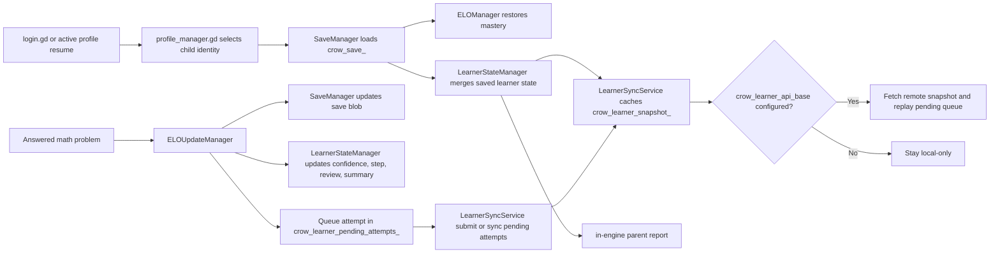

# Learner State And Sync Architecture

Status: Current
Authority: Runtime code and data, especially `profile_manager.gd`, `save_manager.gd`,
`learner_state_manager.gd`, `learner_sync_service.gd`, `cloud_sync.gd`, and
`server/migrations/**`. The wire contract is `docs/API_CONTRACT.md`.
Last verified against code: 2026-03-31

## Purpose

This document explains how Hörmann stores child identity, learner state, local cache, pending sync work, and optional hosted backend integration.

What this is:
- the current identity, save, cache, and hosted-sync reference
- the boundary doc for `ProfileManager`, `SaveManager`, `LearnerStateManager`, and `LearnerSyncService`
- the place to understand how one active child moves from login to local progress to optional remote sync

What this is not:
- not the learner-difficulty tuning doc
- not the canonical place for mutable repo counts
- not proof that a production backend is already deployed

Read this with:
- [ONBOARDING_AGENT.md](../ONBOARDING_AGENT.md) for routing and current repo snapshot
- [MATH_SYSTEM_ARCHITECTURE.md](../MATH_SYSTEM_ARCHITECTURE.md) for adaptive difficulty, review, and unlock behavior

## System Map



## At A Glance

Single active child lifecycle:

```text
ProfileManager selects child identity
    ->
SaveManager loads crow_save_<username>
    ->
ELOManager restores mastery
    ->
LearnerStateManager merges learner snapshot state
    ->
LearnerSyncService caches snapshot locally
    ->
optional remote snapshot fetch
    ->
optional pending queue replay
    ->
child answers a problem
    ->
ELOUpdateManager updates mastery, confidence, review, and save
    ->
LearnerSyncService queues the attempt and optionally submits it
    ->
the in-engine parent report shows the resulting learner snapshot
```

Ownership boundary:
- [MATH_SYSTEM_ARCHITECTURE.md](../MATH_SYSTEM_ARCHITECTURE.md) owns tuning rules
- this document owns identity, persistence layers, queueing, and backend contracts
- [ONBOARDING_AGENT.md](../ONBOARDING_AGENT.md) owns the mutable snapshot counts and first-stop operational routing

## Identity Model

Hörmann is now family-oriented even when used locally.

Live identity fields in [godot/scripts/autoload/profile_manager.gd](../godot/scripts/autoload/profile_manager.gd):

- `username`
- `pinHash`
- `createdAt`
- `childId`
- `familyId`

Practical meaning:
- a browser can hold multiple child profiles
- each profile has its own save key
- each profile also has stable learner keys tied to `childId`
- `familyId` is the DEVICE-LOCAL family handle. The server issues its own
  `remoteFamilyId`, stored alongside it; the local value is never an
  authorization subject (see `docs/API_CONTRACT.md`)
- live runtime usernames are globally unique in the browser profile list

## Glossary

- profile:
  - the browser-local child login record stored by `ProfileManager`
- save:
  - the profile-scoped `SaveData` blob stored at `crow_save_<username>`
- learner snapshot:
  - the structured learner state stored inside the save and also cached separately per child
- pending queue:
  - unsynced attempt submissions stored at `crow_learner_pending_attempts_<childId>`
- mastery:
  - the slow ELO-based ability estimate
- confidence:
  - the fast per-domain offset used for problem selection
- review:
  - the explicit spaced-repetition queue of active skill follow-ups

## Local Storage Contract

Current keys:

- `crow_profiles`
- `crow_active_user`
- `crow_family_id`
- `crow_save_<username>`
- `crow_save_v1`
- `crow_translations`
- `crow_learner_api_base`
- `crow_learner_snapshot_<childId>`
- `crow_learner_pending_attempts_<childId>`

How they are used:

- `crow_profiles` and `crow_active_user` drive login and startup routing
- `crow_save_<username>` stores the profile-scoped `SaveData`
- `crow_save_v1` exists as a legacy fallback for older single-user saves
- `crow_learner_snapshot_<childId>` is the cached learner snapshot
- `crow_learner_pending_attempts_<childId>` is the offline retry queue
- `crow_learner_api_base` enables hosted sync

## Runtime Responsibilities

### ProfileManager

Owns:
- profile creation, login, logout, deletion
- save-key derivation
- family id creation
- child id assignment
- legacy save migration

### SaveManager

Owns:
- the profile-scoped `SaveData` blob
- aggregated math stats
- inventory, coins, XP, levels, settings
- embedded `eloStats`
- embedded `learnerState`

### LearnerStateManager

Owns:
- mastery snapshot
- confidence offsets
- curriculum-step progress per domain
- active review items
- recent attempts
- recent problem ids
- unlock state
- learner summary and frustration flags
- sync metadata fields on the snapshot

### LearnerSyncService

Owns:
- local learner snapshot cache
- pending attempt queue
- hosted sync fetch and submit calls
- fallback to local-only behavior when no backend is configured

## Boot And Profile Lifecycle

Boot flow in [godot/scripts/autoload/data_manager.gd](../godot/scripts/autoload/data_manager.gd):

1. `ProfileManager` loads browser profiles.
2. `SaveManager` loads the active profile save or defaults.
3. `ELOManager` initializes mastery from `saveData.eloStats`.
4. `LearnerStateManager` initializes from:
   - active profile identity
   - saved learner snapshot
   - live mastery stats
5. `MathProblemManager` hydrates recent-problem history from the learner snapshot.
6. `LearnerSyncService` caches the active snapshot and optionally starts remote sync.

No-active-profile boot path:
- `SaveManager` still loads through `crow_save_v1` when there is no active profile yet
- `LearnerStateManager` initializes with placeholder local identity values until a real profile is selected
- `boot.gd` can still cache learner state and initialize sync before routing to login
- this is a continuity fallback, not the same thing as running legacy profile migration

Profile switch behavior:
- `login.gd` `_finish_login()` owns the normal profile-switch rehydrate path after `SaveManager.switch_profile()`
- `boot.gd` mirrors that same rehydrate sequence only on cold start when an active profile already exists

Profile deletion behavior:
- profile save is removed
- learner snapshot cache is removed
- pending attempt queue is removed

Legacy save note:
- `crow_save_v1` still exists as a fallback key and `ProfileManager` still exposes `migrateLegacySave`
- Boot does not automatically invoke that migration helper today
- contributors should treat legacy migration as a manual or future integration path, not an active boot behavior

## Truth Order And Precedence

For the active child, truth currently resolves in this order:

1. `ProfileManager`
   - decides which child identity is active
2. `SaveManager`
   - loads the profile-scoped save blob
3. `ELOManager`
   - restores mastery from `saveData.eloStats`
4. `LearnerStateManager`
   - merges profile identity with `saveData.learnerState`
   - always refreshes mastery from the live `ELOManager` state
5. `LearnerSyncService`
   - caches that merged snapshot locally
   - if a remote backend is configured, it may replace the active in-memory snapshot with the fetched remote snapshot
6. pending queue sync
   - queued attempts are replayed after remote fetch when sync is attempted

Practical precedence rules:
- active profile identity always wins over any saved or remote child identity
- remote snapshots for the active child are normalized back to the active profile's `childId` and `familyId` before they replace in-memory learner state
- live mastery from `ELOManager` wins over stale mastery embedded in an older learner snapshot during initialization
- cached local snapshot is the fallback when remote fetch fails
- successful remote fetch or sync can replace the in-memory snapshot
- failed remote submission never blocks local progression; it only leaves the attempt in the pending queue

## Learner Lifecycle

End-to-end active-child lifecycle:

1. child logs in or is already active
2. profile save loads
3. mastery restores from save
4. learner snapshot merges from save plus live mastery
5. snapshot is cached locally
6. if API base exists:
   - remote snapshot fetch may replace the active snapshot
   - pending attempts are replayed
7. child answers a problem
8. local mastery, confidence, review, save data, and cached snapshot all update immediately
9. attempt is queued for sync
10. remote submit either:
   - succeeds and clears the queue entry
   - or fails and leaves the queue entry for retry

## Learner Snapshot Shape

The current snapshot contains:

- `childId`
- `familyId`
- `mastery`
- `confidenceOffsets`
- `curriculumProgress`
- `reviewItems`
- `recentAttempts`
- `recentProblemIds`
- `domainHistory`
- `unlockState`
- `latestSyncCursor`
- `lastSyncedAt`
- `syncStatus`
- `summary`

Live sync statuses used by runtime today:
- `local-only`
- `pending`
- `synced`

The shared type also includes `error`, but the current runtime does not actively set it.

## Hosted Sync Contract

Configured by:
- `crow_learner_api_base`

Live methods in [godot/scripts/systems/learner_sync_service.gd](../godot/scripts/systems/learner_sync_service.gd):

Current client auth model:
- none built into runtime yet
- the configured learner API base is treated as a trusted local integration point
- real auth remains backend integration work, not shipped client behavior

### Implemented Today In Client Runtime

### `getLearnerSnapshot(childId)`

Implemented behavior:
- fetches `GET {apiBase}/learner/{childId}/snapshot`
- falls back to cached local snapshot on failure
- replaces the active in-memory learner snapshot when the requested child is active

### `submitAttempt(attempt)`

Implemented behavior:
- immediately queues the attempt locally
- caches the latest local snapshot
- if no backend exists:
  - marks sync as `local-only`
  - returns the local snapshot
- if backend exists:
  - posts to `POST {apiBase}/learner/{childId}/attempt`
  - removes applied attempts from the queue on success
  - replaces the in-memory snapshot with the returned snapshot
  - marks sync as `synced`
  - on failure, keeps the attempt queued and marks sync as `pending`

Return semantics:
- `appliedAttemptIds` should be treated as remotely accepted attempt ids
- local-only or failed remote submits do not count as remotely applied

### `syncPendingAttempts(childId, pendingAttempts?)`

Implemented behavior:
- posts queued attempts to `POST {apiBase}/learner/{childId}/attempts/sync`
- removes applied attempt ids on success
- replaces the active snapshot on success
- keeps the queue intact and marks sync as `pending` on failure

### Provisional Backend Contract Expectations

These are backend contract expectations, not shipped client guarantees:

- `attemptId` should be treated as the idempotency key
- repeated delivery of the same attempt should not double-apply mastery updates
- `GET /learner/{childId}/snapshot` should return a full `LearnerSnapshot`
- submit and sync responses should return:
  - applied attempt ids
  - a latest sync cursor
  - an authoritative snapshot that already reflects accepted attempts in order

Conflict rule:
- client keeps local progress first
- server reconciliation should return a snapshot that already reflects accepted pending attempts in order
- the client then replaces local in-memory snapshot only after that successful authoritative response

Remote refresh and save-copy note:
- remote fetch and sync success update in-memory learner state and the cached child snapshot
- they do not immediately rewrite the embedded `learnerState` copy inside `crow_save_<username>`
- that embedded save copy is refreshed on the next normal save path through `SaveManager`

## Persisted Vs Derived Fields

Use this table to avoid mixing storage layers:

| Concept | Source Of Truth | Stored Where | Notes |
| --- | --- | --- | --- |
| Active profile | `ProfileManager` | `crow_profiles`, `crow_active_user` | Browser-local identity |
| Save blob | `SaveManager` | `crow_save_<username>` | Profile-scoped game state |
| Mastery ELO | `ELOManager` during runtime, persisted by `SaveManager` | save blob and learner snapshot | Live mastery is refreshed before snapshot reads |
| Confidence offsets | `LearnerStateManager` | learner snapshot | Persisted and used for selection |
| Review queue | `LearnerStateManager` | learner snapshot | Persisted and replayed locally |
| Cached snapshot | `LearnerSyncService` | `crow_learner_snapshot_<childId>` | Fast local fallback |
| Pending queue | `LearnerSyncService` | `crow_learner_pending_attempts_<childId>` | Unsynced attempts only |
| Summary and unlock projections | `LearnerStateManager` | learner snapshot | Derived from mastery, confidence, review, and recent attempts |

## Offline Behavior

Hörmann is intentionally safe during short network loss:

- local mastery and learner state update immediately
- attempts are queued before remote submission
- the current snapshot is always cached locally
- if the backend is unavailable, the child can keep playing without blocking the game

This means:
- local progression continues first
- hosted sync is eventually consistent
- remote sync failures fall back to local state and currently do not set the unused `error` sync status

## If You Only Remember Three Things

- `crow_save_<username>` is the profile-scoped game save, but learner cache and pending sync queue also live outside it under child-specific keys.
- local progress always updates first; hosted sync is an additive layer and should never block the child from continuing.
- the active profile identity, live mastery from `ELOManager`, and the cached learner snapshot have different responsibilities; bugs usually come from mixing those layers.

## Admin Surface

The parent-facing surface is now in-engine, not a separate HTML page.

Why the old page had to go rather than be ported: `admin.html` read browser
`localStorage`, while the Godot build stores everything in
`user://crow_localstorage.json` — IndexedDB on the web export. Identical key
names, different storage engine, so it could not see this game's data at all.
Its translation editor was deliberately not replaced: shipping a live string
editor to the public would let anyone on a shared family device rewrite what a
child reads.

The in-engine parent report ([../godot/scripts/ui/parent_report.gd](../godot/scripts/ui/parent_report.gd)):
- reads child profiles from the local store, not from browser localStorage
- renders a per-domain line from the learner snapshot embedded in each child's save
- surfaces a plain-language note when confidence has dropped, because "the
  questions got easier" is deliberate design and reads as a bug without it
- exposes NO API base field. That was the old page's most dangerous control: the
  base was client-writable, so anything on the origin could redirect a child's
  learning records. It is now a relative same-origin path, debug-override only.

## Backend schema

The shipped schema is **[../server/migrations/](../server/migrations/)**, and the
contract it serves is **[API_CONTRACT.md](./API_CONTRACT.md)**.

`docs/learner_backend_schema.sql` is a **superseded draft**. It carries a banner
saying so, and it must not be implemented. Three things in it are actively wrong:

| Draft | Why it must not be built |
| --- | --- |
| `child_profiles.pin_hash` | `_hash_pin()` is `btoa(pin + ':' + username)` — reversible. The PIN is a child selector, not a credential, and building this imports a fake credential for a minor into a database. |
| `uuid`-typed attempt and review ids | the client generates `"attempt-<ms>-<rand>"`; those inserts fail. The shipped schema uses `text`. |
| `unique (username)` globally | rejects the second family with a child called Emma. Uniqueness is scoped to the family. |

The shipped shape instead:

- `families` ← `parents(email)` — the parent's email is the only PII stored
- `children(family_id, display_name)` — no PIN, no other child data
- `devices` + `device_tokens(token_sha256)` — the authorization subject is the
  DEVICE, scoped to a family, never the child
- `child_saves` — one save blob per child, arbitrated by `problems_attempted`
- `child_save_history` — the last 20 versions, so a bad merge is recoverable
- `attempts(child_id, attempt_id)` — append-only, idempotent, `text` ids
- `sync_conflicts` — instrumentation for the accepted v1 merge cost

Mastery is deliberately **not** a table. `learner_state_manager.gd` recomputes it
from ELO on every read, so storing it as authoritative would invite drift. If a
parent dashboard ever needs it server-side, it is a projection off `attempts` and
should be labelled as one.

Family isolation is enforced twice: an explicit `family_id` predicate in every
query, and Postgres row-level security. Note the trap that was found the hard way
— a superuser bypasses RLS unconditionally, and Railway's `DATABASE_URL` user is
one, so the API drops to a non-superuser role per transaction. Without that, the
policies are decorative.

## Debug Checklist

- verify the active profile first
- compare `crow_save_<username>` against `crow_learner_snapshot_<childId>`
- inspect `crow_learner_pending_attempts_<childId>` before assuming sync dropped data
- clear the smallest relevant key instead of calling `localStorage.clear()`
- use the in-engine parent report to sanity-check learner summary state quickly
