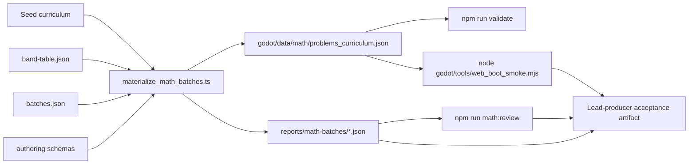

# Crow Math Authoring Pipeline

Status: Current
Authority: Current workflow guide for offline math authoring, materialization, and review. Runtime truth still lives in `godot/data/math/**` plus the live selection code in `godot/scripts/math/**` and `godot/scripts/systems/**`. The offline pipeline itself runs on `math-kernel/**`, which never ships.
Last verified against code: 2026-03-31

## Purpose

What this is:
- the current offline pipeline for growing Crow math content from trusted templates
- the source of truth for where batch specs, band tables, seed content, and review outputs live
- the guide for how lead-producer-style triple verification is encoded in the repo today

What this is not:
- not the runtime selection architecture doc
- not the learner save and sync doc
- not a live generator design
- not permission to hand-edit `godot/data/math/problems_curriculum.json` directly

Use [MATH_SYSTEM_ARCHITECTURE.md](../MATH_SYSTEM_ARCHITECTURE.md) for runtime behavior and [docs/LEARNER_STATE_AND_SYNC_ARCHITECTURE.md](./LEARNER_STATE_AND_SYNC_ARCHITECTURE.md) for persistence and sync.

## Pipeline Map



## Current Model

Crow still ships concrete JSON math pools at runtime.

The authoring layer is offline-only:
- `authoring/math/seed/problems_curriculum_seed.json`
- `authoring/math/band-table.json`
- `authoring/math/batches.json`
- `authoring/math/schemas/*.json`

Materialization writes back into the live runtime pool:
- `godot/data/math/problems_curriculum.json`

Review outputs live in:
- `reports/math-batches/review-summary.json`
- `reports/math-batches/batches/*.json`
- `reports/math-batches/runtime-selector-smoke.json`
- `reports/math-batches/runtime-browser-smoke.json`
- `reports/math-batches/owl-surface-summary.json`

How to read the owl reports:
- `owlEligible*` is the full owl-safe runtime inventory after owl-domain filtering.
- `openingUnlockedInventory*` is the unlocked-domain inventory before current-step clamping.
- `freshReachable*` is the real fresh-profile day-one reachable subset after current-step clamping.
- `currentInteractionProblemCount` is the shipped owl encounter length from the live NPC config.

## Commands

Use these when touching math authoring:

```powershell
npm run math:materialize
npm run math:review
node godot/tools/web_boot_smoke.mjs
npm run validate
```

`math:materialize`:
- loads the seed curriculum plus the offline batch specs
- protects exact prompt text already present in the seed plus the legacy runtime pools
- materializes the concrete curriculum output
- rewrites `godot/data/math/problems_curriculum.json`
- rewrites batch review reports

`math:review`:
- runs the same materialization in memory
- emits batch grades and acceptance status to the terminal
- includes a runtime-aligned owl selector smoke report using the shared owl-selection helper plus live learner-state and NPC-config rails

`math:browser-smoke`:
- runs a literal browser-backed smoke against the live dev app
- clears local Crow state for the smoke run, starts `level_01`, triggers the first owl, answers one wrong then corrected retry, answers the follow-up problem, and verifies overlay close plus completion payloads
- rewrites `reports/math-batches/runtime-browser-smoke.json`
- refreshes screenshots in `output/playwright/math-browser-smoke/*.png`

`validate`:
- validates authoring schemas
- validates runtime problem schemas
- fails on curriculum drift between offline authoring and live output
- recomputes arithmetic answers from prompt text and fails on answer drift
- recomputes `difficultyTraits` and fails on metadata drift
- fails on duplicate prompt text across the shipped runtime pools
- fails when generated problems fall outside their intended curriculum-step or ELO bands
- fails when the checked-in math review reports drift from freshly recomputed review output

## Authoring Contracts

Band table:
- owns intended curriculum-step and initial-ELO ranges
- batch templates reference a `bandId`
- concrete problems do not set difficulty ad hoc; materialization derives it from the band table

Batch specs:
- are organized as 18 small waves
- use deterministic templates instead of freeform concrete problem authoring
- keep the runtime pool concrete and fully reviewable

Generated runtime problems:
- carry `generator` metadata for provenance
- are still plain concrete `MathProblem` rows
- do not invoke a runtime generator during play

## Review Model

The current repo-encoded review loop mirrors the lead-producer plan:

1. Template review
   - pacing
   - family coverage
   - replay variance surface
2. Concrete batch review
   - arithmetic correctness
   - metadata correctness
   - option correctness
   - prompt uniqueness inside the generated batch
   - exact prompt overlap against the protected seed plus legacy runtime surface
   - curriculum-step and ELO-band alignment
3. Selection-proxy review
   - steady child
   - struggling child
   - strong child
   - Devil's Advocate replay/exhaustion check
4. Runtime-aligned owl selector smoke
   - shared owl-selection helper used by the live component
   - live learner-state progression and unlock rules
   - live operand cap and curriculum-step cap checks
   - Devil's Advocate local-safe rail check
   - not the literal browser scene/input/retry flow
5. Browser-backed owl smoke
   - literal `MathChallengeScene` input path
   - wrong-answer retry timing
   - second-problem follow-up path
   - overlay close and completion payload verification
   - still not pedagogy proof on its own

Acceptance rule:
- average grade `>= 9.0`
- no reviewer role below `8.5`
- no critical defects
- Devil's Advocate passes

## Current Targets

The live 3,000-problem rollout is calibrated to end at these full-repo totals:
- addition: `1000`
- subtraction: `850`
- multiplication: `400`
- division: `250`
- counting: `125`
- comparison: `125`
- pattern matching: `125`
- number sequence: `125`

Mutable numeric pool counts still live only in [ONBOARDING_AGENT.md](../ONBOARDING_AGENT.md).

## Evidence Boundaries

What this does prove:
- the shipped runtime pools are concrete, schema-valid, arithmetic-valid, and exact-prompt-deduped
- generated problems stay inside their intended step and initial-ELO bands
- the current local owl path stays inside its local-safe rails in the smoke run
- the current owl summary is config-driven, so it reflects the shipped owl domains and interaction length instead of a hard-coded arithmetic-only assumption
- the smoke run now exercises the shared owl-selection helper used by the live component, including multi-problem encounters, alternate-domain follow-up preference, and constrained fallback behavior
- `runtime-selector-smoke.json` is runtime-aligned selector evidence
- `runtime-browser-smoke.json` is literal browser-backed `MathChallengeScene` input / retry / follow-up / close-path evidence

What this does not prove:
- not telemetry-backed pedagogical calibration
- not that the frozen ELO bands are empirically perfect for every child
- not semantic dedupe of every arithmetic fact phrased in different words
- not future hosted-backend calibration or liveops tuning
- not broad browser coverage beyond the specific owl smoke path checked in `runtime-browser-smoke.json`
- not that the full `3000` total inventory is a `3000`-moment owl curriculum
- not that `openingUnlockedInventory*` equals the fresh-profile day-one surface; use `freshReachable*` for that
- not perfect child-perceived replay variety proof on its own, even though the shipped owl opening now mixes addition with counting and serves `2` problems per encounter
- not a substitute for manual play with a real child; the report can prove rail safety and coverage, but it cannot tell you whether a specific six-year-old will find the follow-up mix delightful or tiring

## Guardrails

- Do not hand-grow `gaps` or `dataset` pools as the long-term path.
- Do not directly merge LLM-authored concrete problems into runtime pools.
- Do not edit the materialized curriculum without rerunning `math:materialize`.
- If a batch fails review, fix that batch and rerun the review loop before authoring more.
- Treat `review-summary.json` as a deterministic repository-side scorecard, not an independent reviewer verdict.
- Treat `owl-surface-summary.json` as the owl-safe inventory plus fresh-profile subset report: it is the right place to see what the shipped owl path can expose overall and what a fresh child actually reaches today.
